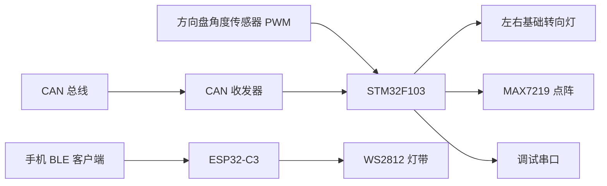

# 车载转向灯与氛围灯项目

一个面向车载场景的嵌入式灯光控制项目。当前仓库包含两个子系统：

- `STM32F103` 主控固件：负责方向盘角度采集、转向灯控制、点阵显示、CAN 报文解析与调试输出
- `ESP32-C3` 扩展固件：负责 BLE 指令接收与 WS2812 灯带效果控制

主工程采用 `STM32 HAL + FreeRTOS + CMake` 组织，整体结构已经具备继续扩展为完整车载灯光控制平台的基础。

## 项目目标

本项目希望实现一套“可感知、可联动、可扩展”的车载灯光控制方案，核心能力包括：

- 通过方向盘角度传感器识别左转、右转、回正状态
- 驱动左右基础转向灯按状态闪烁
- 通过 MAX7219 8x8 点阵显示转向、加速、减速、停车等图案
- 通过 CAN 总线接收车辆状态并驱动显示逻辑
- 通过串口输出调试信息，便于硬件联调
- 预留蓝牙与氛围灯扩展能力

## 功能概览

### STM32 主控部分

- `app_gonio`：采集方向盘磁编码器 PWM，判断左转、右转、回正
- `app_trun_lamp`：驱动左右基础转向灯闪烁
- `app_dot_displayer`：驱动 MAX7219 点阵显示状态图案
- `app_can`：解析 CAN 报文中的模式字段，映射为显示事件
- `app_debug`：通过串口输出运行日志和错误信息
- `event_bus`：使用 FreeRTOS EventGroup 实现模块间协同

### ESP32-C3 扩展部分

- BLE 接收手机发送的字符串命令
- 控制 WS2812 左右灯带、刹车灯、危险报警灯效
- 支持指令回包与心跳通知

当前 BLE 示例命令包括：

- `turnleft`
- `turnright`
- `danger`
- `offled`
- `brake`

## 系统架构



STM32 主控内部采用“任务 + 事件”的架构：

1. `main.c` 初始化各模块并创建 FreeRTOS 任务
2. `app_gonio` 产生转向事件
3. `app_can` 产生车辆状态事件
4. `app_trun_lamp` 消费转向事件，控制左右灯闪烁
5. `app_dot_displayer` 消费转向和车辆状态事件，更新点阵图案

更完整的软件架构说明见：[doc/架构设计.md](doc/架构设计.md)

## 目录结构

```text
.
├── mcu/
│   ├── app/          # 应用层：业务逻辑模块
│   ├── bsp/          # BSP 层：GPIO/SPI/TIM/USART/CAN/DMA 封装
│   ├── user/         # 系统入口、事件总线、中断与 RTOS 钩子
│   ├── libx/         # 基础类型、错误码、公共配置
│   └── Libraries/    # STM32 HAL、CMSIS、启动文件、链接脚本
├── crm/freeRTOS/     # FreeRTOS 内核与 ARM_CM3 移植层
├── project/          # CMake 工程与交叉编译工具链配置
├── ESP32-C3/         # ESP32-C3 蓝牙与 WS2812 独立工程
├── doc/              # 原理图、数据手册、协议图与设计文档
└── README.md
```

## 默认硬件接口

以下为代码中的默认引脚映射，实际接线前请结合原理图与宏定义再次确认。

| 功能                | 默认接口         | 说明                              |
| ------------------- | ---------------- | --------------------------------- |
| 方向盘角度 PWM 输入 | `PA6 / TIM3_CH1` | 磁编码器 PWM 输入捕获             |
| 左转灯输出          | `PA2`            | GPIO 推挽输出                     |
| 右转灯输出          | `PA1`            | GPIO 推挽输出                     |
| MAX7219 CLK         | `PA5`            | `SPI1_SCK`                        |
| MAX7219 DIN         | `PA7`            | `SPI1_MOSI`                       |
| MAX7219 CS          | `PA4`            | 软件片选                          |
| 调试串口 TX/RX      | `PA9 / PA10`     | `USART1`, `115200`                |
| CAN 默认引脚        | `PB8 / PB9`      | `CAN1`，当前默认使用重映射 CASE 2 |

说明：

- CAN 正常模式下需要外接 CAN 收发器，不能直接只连 MCU 引脚。
- CAN 重映射、模式和波特率可在 `mcu/bsp/bsp_can.h` 中调整。
- 点阵方向可通过 `mcu/app/app_dot_displayer.h` 中的 `TurnCount` 调整旋转次数。

## 软件设计要点

### 1. 分层清晰

- `App` 层负责业务语义
- `User` 层负责系统编排和任务组织
- `BSP` 层负责底层外设访问

### 2. 事件驱动

系统通过 `FreeRTOS EventGroup` 管理关键事件，包括：

- `EVT_TURN_LEFT`
- `EVT_TURN_RIGHT`
- `EVT_TURN_BACK`
- `EVT_UP`
- `EVT_DOWN`
- `EVT_STOP`

这种方式降低了模块间直接耦合，便于后续加入新的显示源或控制逻辑。

### 3. 中断轻量化

- 角度采样通过 `TIM3` 输入捕获中断完成底层数据搬运
- CAN 接收通过 FIFO 中断 + 队列传递到任务上下文
- 复杂逻辑尽量放在任务中处理，保证实时性和可维护性

## 构建方式

### 环境依赖

建议准备以下工具：

- `arm-none-eabi-gcc`
- `arm-none-eabi-g++`
- `cmake`
- `ninja`
- `openocd`

### 配置与编译

在仓库根目录执行：

```bash
cmake -DCMAKE_TOOLCHAIN_FILE=project/arm-gnu-none-eabi.cmake \
  -DCMAKE_SYSTEM_NAME=Generic \
  -DCMAKE_EXPORT_COMPILE_COMMANDS:BOOL=TRUE \
  -GNinja \
  -S project \
  -B build

cmake --build build --target all
```

构建完成后将生成：

- `build/ATMOSPHERE_LAMP.elf`
- `build/ATMOSPHERE_LAMP.hex`
- `build/ATMOSPHERE_LAMP.bin`

## 烧录与调试

### OpenOCD 烧录

```bash
openocd -f interface/cmsis-dap.cfg \
  -f target/stm32f1x.cfg \
  -c "program build/ATMOSPHERE_LAMP.elf verify reset exit"
```

### VS Code

仓库已提供：

- `.vscode/tasks.json`
- `.vscode/launch.json`

可直接在 VS Code 中使用：

- `CMake 配置`
- `CMake 构建`
- `烧录`
- `Debug with OpenOCD`

## 调试建议

### 串口调试

- 默认使用 `USART1`
- 波特率 `115200`
- 项目中已将 `printf` 重定向到串口

### CAN 联调

- 若无外接收发器，建议优先切换到回环模式验证软件链路
- 若长时间收不到报文，可先检查引脚重映射、波特率、ACK、终端电阻和收发器供电

### 点阵联调

- 点阵模块上电后带有测试模式与 `START` 图案自检
- 若显示方向不对，可调整 `TurnCount`

## 文档索引

- [doc/架构设计.md](doc/架构设计.md)：软件架构设计说明书
- `doc/接线示意图.dio`：接线示意图
- `doc/schematic/stm32工控板 _ MCU原理图.pdf`：MCU 原理图
- `doc/schematic/STM32F103C8T6引脚定义.png`：芯片引脚定义
- `doc/datasheet/can总线通信帧格式.png`：CAN 协议字段参考
- `doc/datasheet/STM32F103x8B数据手册（英文）.pdf`：芯片数据手册

## 当前状态

当前仓库已经具备以下基础：

- STM32 主控业务链路完整
- FreeRTOS 任务和事件协作已成型
- CAN 状态到点阵显示的映射已实现
- ESP32-C3 BLE 氛围灯扩展已具备独立演示能力

后续可继续完善：

- 系统时钟配置与硬件参数统一说明
- STM32 与 ESP32-C3 的联动协议
- 更完整的接线文档与联调手册
- 故障检测、配置管理与显示策略仲裁
