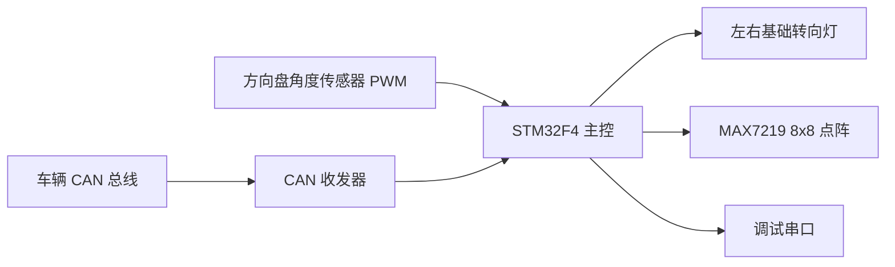

# 智能氛围灯项目

一个面向车载灯光控制场景的嵌入式项目仓库。当前方案以 `STM32F4` 主控平台为唯一控制核心，由主控芯片统一完成方向盘角度采集、转向灯控制、点阵显示、CAN 状态解析与串口调试。

当前主链路已经形成 `方向采集 -> 转向灯控制 -> 点阵显示 -> CAN 解析 -> 串口调试` 的闭环设计。外部无线连接与独立扩展控制器不在当前方案范围内，所有控件均由主控芯片直接协调。

## 项目定位

本项目可以理解为一套以 `STM32F4` 为主控制平台、以车载转向与状态显示为核心的智能灯光控制系统。当前仓库重点覆盖以下能力：

- 基于方向盘角度传感器 PWM 识别左转、右转与回正状态
- 根据转向状态驱动左右基础转向灯闪烁
- 使用 `MAX7219` 8x8 点阵显示左转、右转、加速、减速、停车等图案
- 通过 `CAN1` 接收车辆状态并更新点阵显示
- 通过 `USART1` 输出调试日志，便于硬件联调
- 为后续网络通信、远程诊断与参数配置预留扩展空间

## 系统概览



主工程的软件分层为 `App / User / BSP / HAL+FreeRTOS`：

- `App` 层负责转向识别、灯光控制、显示策略、CAN 解析和调试输出
- `User` 层负责系统启动、任务编排、事件总线和中断转发
- `BSP` 层封装 GPIO、SPI、TIM、USART、CAN 等底层外设
- `HAL + FreeRTOS` 提供硬件访问基础和任务调度能力

当前实现采用“共享状态 + 通知总线”的协作方式：

- `app_state` 保存共享业务状态：`steer / motion / user_hint`
- `event_bus` 使用 `SIG_LAMP_UPDATE / SIG_DISPLAY_UPDATE / SIG_CAN_RX / SIG_RESERVED_USER` 进行通知唤醒

这意味着状态值和唤醒信号是解耦的，任务读取的是当前状态快照，而不是一次性业务事件。

## 模块概览

| 模块 | 主要职责 |
| --- | --- |
| `system_boot` | 统一完成时钟、模块初始化与任务创建 |
| `app_state` | 维护系统共享状态，作为业务真相源 |
| `event_bus` | 基于 FreeRTOS EventGroup 提供通知型同步 |
| `app_gonio` | 采集方向盘 PWM 角度并判断左转、右转、回正 |
| `app_trun_lamp` | 根据 `steer` 状态驱动左右基础转向灯闪烁 |
| `app_display_policy` | 根据状态快照决定点阵显示图案优先级 |
| `app_dot_displayer` | 驱动 `MAX7219` 刷新 8x8 点阵显示 |
| `app_can` | 解析 CAN 报文中的模式字段并更新 `motion` |
| `app_debug` | 通过串口输出运行日志和故障信息 |

## 核心目录

```text
.
├── mcu/
│   ├── app/          # 应用层：业务逻辑模块
│   ├── bsp/          # BSP 层：GPIO/SPI/TIM/USART/CAN/DMA 封装
│   ├── user/         # 系统入口、事件总线、中断与 RTOS 钩子
│   ├── libx/         # 基础类型、错误码、公共配置
│   └── Libraries/    # STM32 HAL、CMSIS、启动文件、链接脚本
├── crm/freeRTOS/     # FreeRTOS 内核与 ARM_CM 移植层
├── project/          # 主工程 CMake 与交叉编译工具链配置
├── doc/              # 设计文档、原理图、数据手册与协议参考
└── README.md
```

主工程的构建入口位于 `project/CMakeLists.txt`。

## 默认硬件接口

以下为当前软件中的默认接口映射。由于主控平台已收敛到 `STM32F4` 方案，最终引脚复用仍需以实际 F4 板卡原理图与启动配置为准。

| 功能 | 默认接口 | 说明 |
| --- | --- | --- |
| 方向盘角度 PWM 输入 | `PA6 / TIM3_CH1` | 磁编码器 PWM 输入捕获 |
| 左转灯输出 | `PA2` | GPIO 推挽输出 |
| 右转灯输出 | `PA1` | GPIO 推挽输出 |
| MAX7219 CLK | `PA5` | `SPI1_SCK` |
| MAX7219 DIN | `PA7` | `SPI1_MOSI` |
| MAX7219 CS | `PA4` | 软件片选 |
| 调试串口 TX/RX | `PA9 / PA10` | `USART1`, `115200` |
| CAN 默认引脚 | `PB8 / PB9` | `CAN1`，默认使用重映射 CASE 2 |

补充说明：

- `PA1 / PA2` 当前更适合作为低功率指示输出或外部驱动级输入，若要直连真实车载灯具，仍需补充隔离和功率驱动电路
- CAN 正常模式下需要外接收发器，不能仅连接 MCU 引脚
- CAN 模式、重映射和波特率可在 `mcu/bsp/bsp_can.h` 中调整
- 点阵方向可通过 `mcu/app/app_dot_displayer.h` 中的 `APP_DOTD_TURN_COUNT` 做旋转适配

## 构建与烧录

建议准备以下工具：

- `arm-none-eabi-gcc`
- `arm-none-eabi-g++`
- `cmake`
- `ninja`
- `openocd`

在仓库根目录执行：

```bash
cmake -DCMAKE_TOOLCHAIN_FILE=project/arm-gnu-none-eabi.cmake \
  -DCMAKE_SYSTEM_NAME=Generic \
  -DCMAKE_EXPORT_COMPILE_COMMANDS:BOOL=TRUE \
  -GNinja \
  -S project \
  -B build

cmake --build build --target all
```

构建产物：

- `build/ATMOSPHERE_LAMP.elf`
- `build/ATMOSPHERE_LAMP.hex`
- `build/ATMOSPHERE_LAMP.bin`

使用 `OpenOCD` 烧录：

```bash
openocd -f interface/cmsis-dap.cfg \
  -f target/stm32f4x.cfg \
  -c "program build/ATMOSPHERE_LAMP.elf verify reset exit"
```

仓库已提供 VS Code 集成文件：

- `.vscode/tasks.json`
- `.vscode/launch.json`
- `.vscode/settings.json`

可直接使用的任务包括：

- `CMake 配置`
- `CMake 构建`
- `烧录`
- `Debug with OpenOCD`

## 调试建议

- 串口调试：默认使用 `USART1`，波特率 `115200`，项目已将 `printf` 重定向到串口
- CAN 联调：无真实总线和 ACK 节点时，优先使用回环模式验证软件链路；接入真实总线时再切回正常模式
- 点阵联调：上电会先执行测试模式和 `START` 图案自检；若方向不对，可调整 `APP_DOTD_TURN_COUNT`
- 硬件升级：迁移到 `STM32F4` 板卡时，应优先复核系统时钟、外设复用、中断映射与启动文件配置

## 文档索引

- [doc/项目框架设计.md](doc/项目框架设计.md)：项目定位、需求分析与总体框图
- [doc/架构设计.md](doc/架构设计.md)：主控固件的软件架构说明
- [doc/各子模块详细设计.md](doc/各子模块详细设计.md)：各模块职责、关键接口与设计细节
- [doc/架构设计.dio](doc/架构设计.dio)：架构图源文件
- [doc/schematic/stm32工控板_MCU原理图_截图.png](doc/schematic/stm32工控板_MCU原理图_截图.png)：历史板卡原理图截图
- [doc/schematic/stm32工控板 _ MCU原理图.pdf](doc/schematic/stm32工控板%20_%20MCU原理图.pdf)：历史板卡原理图 PDF
- [doc/datasheet/can总线通信帧格式.png](doc/datasheet/can总线通信帧格式.png)：CAN 协议字段参考

## 当前状态与未来拓展

当前仓库已经具备以下基础：

- 单主控业务链路完整，已覆盖方向识别、转向灯控制、点阵显示、CAN 解析与串口调试
- `app_state + event_bus` 协作模型已经落地，主任务之间的状态与通知边界清晰
- CAN 到点阵显示的映射已实现，并通过显示策略模块统一仲裁
- 当前方案已不再考虑外部无线连接与独立扩展控制器

短期可继续完善的方向：

- `STM32F4` 板卡迁移后的时钟、引脚复用和驱动配置收敛
- 更完整的接线说明与联调手册
- 故障检测、配置管理与参数化能力
- 基于 `STM32F4` 平台的网络通信能力扩展，例如远程诊断、状态上报与参数配置
