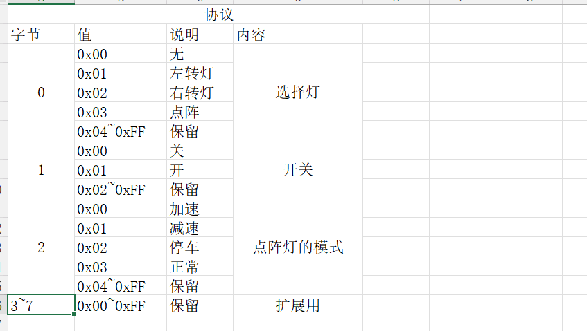

# 智能氛围灯项目各子模块详细设计

## 1. 模块划分总览

| 模块           | 主要文件                                              | 输入               | 输出                    | 作用                 |
| -------------- | ----------------------------------------------------- | ------------------ | ----------------------- | -------------------- |
| 系统启动       | `mcu/user/main.c` `mcu/user/system_boot.c`            | 上电复位           | 任务与外设初始化完成    | 统一编排系统启动顺序 |
| 状态中心       | `mcu/app/app_state.c`                                 | 各业务模块更新请求 | 全局状态快照            | 维护共享业务状态     |
| 事件总线       | `mcu/user/event_bus.c`                                | 模块通知位         | 任务唤醒信号            | 负责轻量级同步       |
| 角度采集       | `mcu/app/app_gonio.c`                                 | 传感器 PWM         | 转向状态                | 识别左转/右转/回正   |
| 转向灯控制     | `mcu/app/app_trun_lamp.c`                             | `steer` 状态       | 左右灯 GPIO             | 控制基础转向灯闪烁   |
| 显示策略       | `mcu/app/app_display_policy.c`                        | 状态快照           | 图案枚举                | 决定点阵显示优先级   |
| 点阵显示       | `mcu/app/app_dot_displayer.c` `mcu/bsp/bsp_max7219.c` | 图案类型           | MAX7219 SPI 数据        | 刷新 8x8 点阵        |
| CAN 驱动与解析 | `mcu/bsp/bsp_can.c` `mcu/app/app_can.c`               | CAN 报文           | `motion` 状态、显示通知 | 接收车辆状态         |
| 串口调试       | `mcu/app/app_debug.c` `mcu/bsp/bsp_usart.c`           | 日志字符串         | 串口输出                | 打印调试与错误信息   |
| 中断与健壮性   | `mcu/user/*_it.c` `mcu/user/freertos_hooks.c`         | 异常/中断          | ISR 转发与故障陷入      | 保证系统稳定运行     |

## 2. 系统启动模块

### 2.1 模块职责

- 完成 HAL 初始化与系统时钟配置
- 初始化全局状态、事件总线与各应用模块
- 创建业务任务
- 在初始化失败时输出错误信息

### 2.2 关键设计

- 系统时钟由 `STM32F4` 板级配置统一给出，并为后续网络通信预留性能余量
- 采用“先底座、后业务、最后建任务”的顺序
- 所有任务统一由 `system_boot.c` 创建，避免初始化职责分散

### 2.3 关键接口

| 接口                        | 说明                     |
| --------------------------- | ------------------------ |
| `system_boot_run()`         | 完成系统初始化与任务创建 |
| `system_boot_create_task()` | 封装任务创建逻辑         |

### 2.4 伪代码

```c
system_boot_run()
{
    HAL_Init();
    setup_clock_for_f4_board();

    event_bus_init();
    app_state_init();

    app_debug_init();
    app_trunL_init();
    app_gonio_init();
    app_dotD_Init();
    app_can_init();

    create_task(Task_Angle, 256);
    create_task(Task_Trun, 128);
    create_task(Task_DotD, 256);
    create_task(Task_CAN, 128);

    return OK;
}
```

## 3. 状态中心与事件总线模块

### 3.1 `app_state` 设计

#### 数据结构

```c
typedef struct
{
    app_steer_state_t steer;
    app_motion_mode_t motion;
    bool user_hint;
} app_state_snapshot_t;
```

#### 设计要点

- 使用全局静态结构体保存业务状态
- 使用 `taskENTER_CRITICAL()` 保护读写一致性
- 提供独立更新接口，避免调用方直接改结构体

#### 状态含义

| 字段        | 取值                  | 含义                      |
| ----------- | --------------------- | ------------------------- |
| `steer`     | `CENTER/LEFT/RIGHT`   | 当前转向状态              |
| `motion`    | `NORMAL/UP/DOWN/STOP` | 当前 CAN 解析出的运动模式 |
| `user_hint` | `true/false`          | 预留用户或网络提示        |

### 3.2 `event_bus` 设计

#### 通知位

| 位   | 名称                 | 用途             |
| ---- | -------------------- | ---------------- |
| bit0 | `SIG_LAMP_UPDATE`    | 转向灯任务刷新   |
| bit1 | `SIG_DISPLAY_UPDATE` | 点阵任务刷新     |
| bit2 | `SIG_CAN_RX`         | 收到有效 CAN 帧  |
| bit3 | `SIG_RESERVED_USER`  | 预留用户或网络扩展事件 |

#### 设计理由

- 状态值适合持久化保存在 `app_state`
- 事件位适合做“一次性唤醒通知”
- 两者分开后，业务更清楚，扩展也更简单

### 3.3 伪代码

```c
update_steer(new_state)
{
    enter_critical();
    APP_STATE.steer = new_state;
    exit_critical();
}

notify_display()
{
    xEventGroupSetBits(MAIN_EVT, SIG_DISPLAY_UPDATE);
}
```

## 4. 方向盘角度采集模块

### 4.1 实物对应

| 项       | 内容                      |
| -------- | ------------------------- |
| 外设     | 外部磁编码器/角度传感器   |
| 信号形式 | PWM                       |
| MCU 引脚 | `PA6 / TIM3_CH1`          |
| 代码模块 | `app_gonio` + `bsp_timer` |

### 4.2 设计思路

- `TIM3` 预分频到 `1MHz`，便于把计数值近似看作 `us`
- `CH1` 捕获周期，`CH2` 捕获高电平宽度
- 中断回调只记录 `period` 和 `pulseWidth`
- 任务每 `20ms` 读取一次，进行角度计算和稳态判定

### 4.3 角度解码

```c
duty = pulseWidth / pwmPeriod;
abs_angle = duty * 360.0f;
rel_angle = wrap_to_-180_180(abs_angle - zero);
```

其中：

- `zero` 为第一次有效角度自动记录的零点
- `wrap_to_-180_180()` 用于处理 `0°/360°` 回绕

### 4.4 转向判定策略

| 条件                                             | 判定 |
| ------------------------------------------------ | ---- |
| `rel >= +90°` 持续约 `300ms`                     | 左转 |
| `rel <= -90°` 持续约 `300ms`                     | 右转 |
| 已处于左右转状态，回到 `±30°` 内并持续约 `300ms` | 回正 |

### 4.5 伪代码

```c
AngleTask()
{
    state = CENTER;
    while (1)
    {
        angle = app_gonio_GetAngleDeg();
        if (angle invalid)
        {
            clear_counters();
            delay(20ms);
            continue;
        }

        if (state == CENTER)
        {
            if (angle >= 90) left_cnt++;
            else if (angle <= -90) right_cnt++;
            else clear_left_right();

            if (left_cnt >= 15)
            {
                state = LEFT;
                app_state_update_steer(LEFT);
                set_bits(LAMP_UPDATE | DISPLAY_UPDATE);
            }
            if (right_cnt >= 15)
            {
                state = RIGHT;
                app_state_update_steer(RIGHT);
                set_bits(LAMP_UPDATE | DISPLAY_UPDATE);
            }
        }
        else
        {
            if (angle >= -30 && angle <= 30) center_cnt++;
            else center_cnt = 0;

            if (center_cnt >= 15)
            {
                state = CENTER;
                app_state_update_steer(CENTER);
                set_bits(LAMP_UPDATE | DISPLAY_UPDATE);
            }
        }

        delay(20ms);
    }
}
```

### 4.6 设计优点

- 自动校零，减少安装误差影响
- 对抖动和瞬时跨阈值有抑制能力
- 中断轻量，主要计算在任务里完成

## 5. 基础转向灯模块

### 5.1 实物对应

| 项       | 内容                       |
| -------- | -------------------------- |
| 左转输出 | `PA2`                      |
| 右转输出 | `PA1`                      |
| 代码模块 | `app_trun_lamp`            |
| 实际对象 | 指示灯或外部功率驱动级输入 |

### 5.2 设计思路

- 初始化时把 `PA1/PA2` 配为推挽输出
- 任务等待 `SIG_LAMP_UPDATE`
- 进入左右转状态后，每 `500ms` 翻转一次输出
- 回正时关闭两路输出

### 5.3 伪代码

```c
LampTask()
{
    state = CENTER;
    blink_on = false;

    while (1)
    {
        wait_ticks = (state == CENTER) ? FOREVER : 500ms;
        bits = wait_bits(SIG_LAMP_UPDATE, wait_ticks);

        if (bits has SIG_LAMP_UPDATE)
        {
            snapshot = app_state_get_snapshot();
            state = snapshot.steer;
            blink_on = (state == CENTER) ? false : true;
        }

        switch (state)
        {
        case LEFT:
            if (timeout) blink_on = !blink_on;
            write(PA2, blink_on);
            write(PA1, OFF);
            break;
        case RIGHT:
            if (timeout) blink_on = !blink_on;
            write(PA1, blink_on);
            write(PA2, OFF);
            break;
        default:
            write(PA1, OFF);
            write(PA2, OFF);
            break;
        }
    }
}
```

### 5.4 设计说明

- 当前实现直接操作 GPIO，结构很轻。
- 如果后续接真实车灯，应在 `PA1/PA2` 后增加隔离和功率驱动。

## 6. 点阵显示与显示策略模块

### 6.1 实物对应

| 项           | 内容                                                   |
| ------------ | ------------------------------------------------------ |
| 点阵驱动芯片 | MAX7219                                                |
| MCU 接口     | `SPI1`                                                 |
| 引脚         | `PA5=SCK` `PA7=MOSI` `PA4=CS`                          |
| 代码模块     | `app_dot_displayer` `app_display_policy` `bsp_max7219` |

### 6.2 点阵图案

当前实现内置图案：

- 左转箭头
- 右转箭头
- 启动图案
- 加速
- 减速
- 停车

图案以 `8 x uint8_t` 位图方式存放，利于直接替换。

### 6.3 显示优先级

策略模块 `app_display_policy` 的优先级如下：

1. 左转
2. 右转
3. 停车
4. 减速
5. 加速
6. 用户提示 `START`
7. 无显示

也就是说，转向状态优先级高于 CAN 运动状态。

### 6.4 上电行为

- 进入任务后先开启 `MAX7219` 测试模式约 `200ms`
- 再显示 `START` 图案约 `200ms`
- 然后清屏

该设计用于快速确认点阵硬件和连线是否正常。

### 6.5 伪代码

```c
DotTask()
{
    max7219_test_on();
    delay(200ms);
    max7219_test_off();

    render(START);
    delay(200ms);
    render(NONE);

    while (1)
    {
        wait_bits(SIG_DISPLAY_UPDATE, FOREVER);
        snapshot = app_state_get_snapshot();
        pattern = app_display_policy_resolve(snapshot);
        render(pattern);
    }
}

resolve(snapshot)
{
    if (steer == LEFT) return DISPLAY_LEFT;
    if (steer == RIGHT) return DISPLAY_RIGHT;
    if (motion == STOP) return DISPLAY_STOP;
    if (motion == DOWN) return DISPLAY_DOWN;
    if (motion == UP) return DISPLAY_UP;
    if (user_hint) return DISPLAY_START;
    return DISPLAY_NONE;
}
```

### 6.6 旋转适配

- `APP_DOTD_TURN_COUNT` 默认为 `0`
- 若点阵安装方向变化，可通过旋转位图来适配，无需改显示逻辑

## 7. CAN 驱动与协议解析模块

### 7.1 实物对应

| 项         | 内容              |
| ---------- | ----------------- |
| MCU 控制器 | `CAN1`            |
| 默认引脚   | `PB8=RX` `PB9=TX` |
| 板载收发器 | `TJA1050T`        |
| 连接器     | `J5`              |
| 终端电阻   | `120R`            |

### 7.2 协议截图



### 7.3 BSP 设计

`bsp_can` 负责：

- GPIO 与 AFIO 重映射初始化
- 自动计算 CAN 位时序参数
- 启动接收中断
- 用长度为 `1` 的队列保存“最新一帧”
- 提供阻塞/非阻塞读取接口

### 7.4 应用层解析设计

`app_can` 负责：

- 从队列中取出报文
- 解析 Byte2 的点阵模式
- 将模式映射到 `app_state.motion`
- 置位 `SIG_DISPLAY_UPDATE`
- 周期性打印 CAN 错误信息，帮助定位无报文原因

模式映射如下：

| Byte2  | 含义 | `motion`            |
| ------ | ---- | ------------------- |
| `0x00` | 加速 | `APP_MOTION_UP`     |
| `0x01` | 减速 | `APP_MOTION_DOWN`   |
| `0x02` | 停车 | `APP_MOTION_STOP`   |
| `0x03` | 正常 | `APP_MOTION_NORMAL` |

### 7.5 兼容逻辑

若联调阶段发送的 DLC 不足 3 字节，代码会尝试把“最后一个字节”当成模式值，只要其范围在 `0x00~0x03` 内。

这样做的目的，是让 CAN 调试工具在简化发送数据时也能快速验证链路。

### 7.6 伪代码

```c
CanTask()
{
    current_mode = NORMAL;
    while (1)
    {
        if (!can_read_message_block(msg, 500ms))
        {
            print_can_state_and_error_if_needed();
            continue;
        }

        if (msg.remote_frame) continue;

        if (msg.len > 2) mode = msg.data[2];
        else if (msg.len >= 1 && last_byte <= 0x03) mode = last_byte;
        else continue;

        want_mode = translate(mode);
        if (want_mode != current_mode)
        {
            current_mode = want_mode;
            app_state_update_motion(current_mode);
            set_bits(SIG_DISPLAY_UPDATE);
        }

        set_bits(SIG_CAN_RX);
        print_rx_log();
    }
}
```

### 7.7 设计要点

- 默认使用正常模式，需要真实收发器和 ACK 节点
- 若无收发器，可切换回环模式做软件自测
- `APP_CAN_SELF_TEST_TX` 默认为 `0`，在回环模式下可打开自发自收联调
- 队列长度为 1，说明该模块关注的是“当前模式”，不是历史帧

## 8. 串口调试模块

### 8.1 实物对应

| 项       | 内容             |
| -------- | ---------------- |
| MCU 接口 | `USART1`         |
| 引脚     | `PA9/PA10`       |
| 波特率   | `115200`         |
| 板载电路 | `SP3232EEN-L/TR` |

### 8.2 设计思路

- `__io_putchar()` 重定向到 `HAL_UART_Transmit()`
- 各模块直接使用 `printf()`
- 初始化失败时优先输出错误类别，便于快速定位

### 8.3 伪代码

```c
int __io_putchar(int ch)
{
    HAL_UART_Transmit(&Debug_USART, &ch, 1, HAL_MAX_DELAY);
    return ch;
}
```

### 8.4 输出内容

- 启动失败信息
- 方向采样调试信息
- 点阵刷新日志
- CAN 接收与错误状态
- FreeRTOS 异常钩子信息

## 9. 中断与系统健壮性模块

### 9.1 中断分工

| 中断                         | 处理内容                                  |
| ---------------------------- | ----------------------------------------- |
| `SysTick_Handler`            | HAL tick + 仅在调度器启动后进入 RTOS tick |
| `TIM3_IRQHandler`            | 角度 PWM 输入捕获                         |
| `HAL_TIM_IC_CaptureCallback` | 把捕获值转发给 `app_gonio`                |
| `USB_LP_CAN1_RX0_IRQHandler` | CAN FIFO0 接收                            |

### 9.2 健壮性设计

- `HardFault_Handler()` 进入死循环，便于调试器定位
- 栈溢出钩子打印任务名
- `malloc` 失败钩子打印堆耗尽信息
- `FreeRTOSConfig.h` 中开启了栈溢出检测和 `malloc` 失败钩子

### 9.3 伪代码

```c
SysTick_Handler()
{
    HAL_IncTick();
    if (scheduler_started)
        xPortSysTickHandler();
}

HardFault_Handler()
{
    disable_interrupts();
    while (1) {}
}
```

## 10. 网络通信扩展预留

### 10.1 模块定位

随着主控平台升级到 `STM32F4`，后续可以在现有单主控架构上继续扩展网络通信能力。该能力当前尚未进入主链路实现，但已经作为未来演进方向纳入设计边界。

### 10.2 预期职责

未来网络通信模块可承担以下职责：

- 对外发布车辆灯光状态、运行状态和故障诊断信息
- 接收远程配置指令或参数下发请求
- 与本地 `app_state` 做状态同步，避免网络侧与本地控制逻辑脱节
- 为后续远程调试、日志上报和运维诊断提供接口基础

### 10.3 设计建议

- 继续保持“`app_state` 保存状态、`event_bus` 负责通知”的现有架构边界
- 网络输入不直接驱动底层外设，而是先映射为共享状态或配置项，再由业务任务执行
- 在 `STM32F4` 板级配置明确后，再统一评估网络外设、协议栈资源占用和任务优先级
- 对远程下发能力增加权限控制、超时保护和故障降级机制

### 10.4 推荐接入方式

后续若进入实现阶段，建议优先按以下顺序评估：

1. 主控板载网络外设或外接网络模块的硬件选型
2. 状态上报、远程诊断、参数配置三类消息的协议边界
3. 网络任务与 CAN/显示/灯光任务之间的调度与优先级策略
4. 网络异常时的本地独立运行与安全降级机制

## 11. 子模块协同结论

### 11.1 STM32 主链路

`app_gonio` 与 `app_can` 是状态生产者，`app_trun_lamp` 与 `app_dot_displayer` 是状态消费者，`app_state + event_bus` 是两者之间的协调中心。

### 11.2 未来网络扩展链路

在保持单主控架构不变的前提下，未来若要扩展网络通信，建议新增：

1. 网络通信输入与 `app_state` 的映射规则
2. 状态上报、诊断上报与参数配置的数据模型
3. 网络异常下的安全降级策略

### 11.3 工程实施建议

若后续做毕业设计、课程设计或实车样机，建议优先补齐以下内容：

1. 转向灯功率驱动级
2. 传感器型号与接线图
3. `STM32F4` 板卡迁移后的时钟、引脚和驱动配置说明
4. 电源保护、车规抗扰与异常处理设计
5. 网络通信的协议、诊断与远程配置方案
