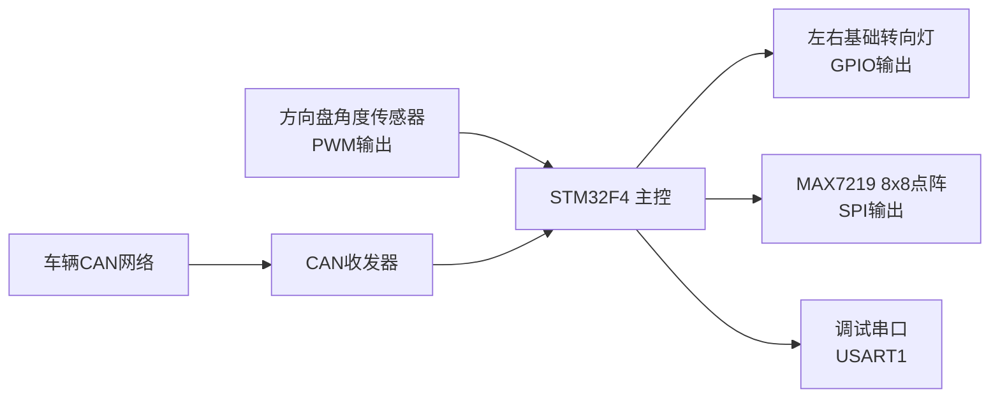
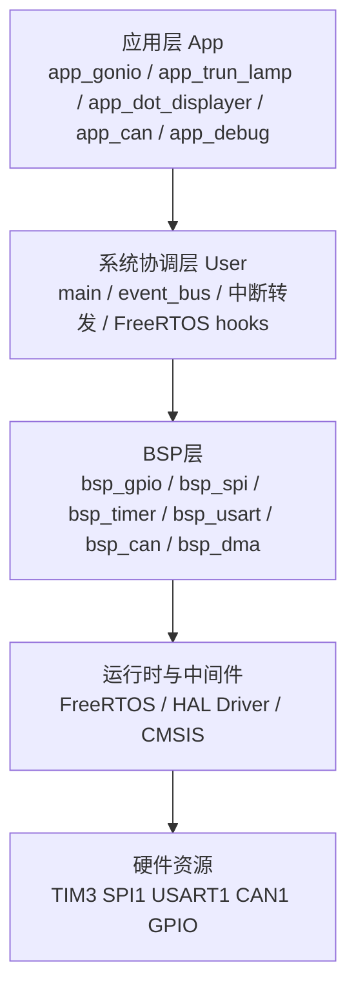

# 智能氛围灯项目软件架构设计说明书

> 注：当前设计以单主控 `STM32F4` 平台为目标形态。外部无线连接与独立扩展控制器不属于当前方案范围，所有控件均由主控芯片统一协调。

## 1. 文档目的

本文档用于说明本项目当前代码实现所体现的软件架构设计，帮助开发者快速理解系统分层、模块职责、运行流程、任务协作、硬件依赖与后续扩展方向。

## 2. 项目概述

项目目标是实现一个面向车载场景的灯光控制系统，核心能力包括：

- 通过方向盘角度传感器识别左转、右转、回正状态
- 驱动左右基础转向灯闪烁
- 通过 MAX7219 点阵屏显示左转、右转、加速、减速、停车等图案
- 通过 CAN 总线接收车辆状态并转化为显示状态
- 通过串口输出调试日志，便于硬件联调
- 基于 `STM32F4` 平台为后续网络通信能力预留扩展空间

从软件形态看，本项目是一个典型的嵌入式分层架构：

- 底层以 `STM32 HAL + CMSIS` 为硬件访问基础
- 中间层用 `BSP` 统一封装 GPIO/SPI/TIM/USART/CAN
- 上层以 `FreeRTOS` 任务和事件总线承载业务逻辑
- 业务模块围绕“转向判断、灯光驱动、显示驱动、CAN 协议解析、调试诊断”展开

## 3. 总体架构

### 3.1 系统上下文

说明：

- `STM32F4` 负责全部主控制链路，是当前方案中的唯一控制核心。
- CAN 接入真实车载总线时，需要外接物理收发器；代码中也提供回环/自测模式，便于无总线环境联调。
- 网络通信不在当前实现范围内，但随着主控平台升级到 `STM32F4`，后续可以继续扩展远程诊断、状态上报和参数配置能力。

### 3.2 软件分层

分层原则如下：

- `App` 层只关心业务语义，不直接操作底层寄存器。
- `User` 层负责系统启动、任务编排、全局事件总线和中断入口对接。
- `BSP` 层负责“某类外设如何初始化和访问”的统一封装。
- `HAL/CMSIS/FreeRTOS` 构成底座，尽量不与业务逻辑耦合。

## 4. 目录与模块组织

### 4.1 目录职责

| 目录 | 职责 |
| --- | --- |
| `mcu/user` | 系统入口、任务创建、事件总线、中断处理、FreeRTOS 钩子 |
| `mcu/app` | 业务应用模块，承载方向识别、灯光控制、点阵显示、CAN 协议解析、调试输出 |
| `mcu/bsp` | 板级支持包，对 GPIO、SPI、TIM、USART、CAN、DMA 做二次封装 |
| `mcu/libx` | 基础类型、错误码、移植配置等公共支撑代码 |
| `mcu/Libraries` | STM32 CMSIS、HAL Driver、启动文件、链接脚本 |
| `crm/freeRTOS` | FreeRTOS 内核与 ARM CM 移植层 |
| `project` | CMake 工程配置、交叉编译工具链配置 |
| `doc` | 原理图、数据手册、协议截图及架构设计文档 |

### 4.2 模块关系

当前主链路中，模块依赖关系可以概括为：

- `main.c` 统一初始化各模块并创建任务
- `event_bus` 作为应用模块之间的通知中心
- `app_state` 作为共享业务状态中心
- `app_gonio` 负责产生转向状态
- `app_can` 负责产生车辆运动状态
- `app_trun_lamp` 负责消费转向状态并控制 GPIO 灯闪烁
- `app_dot_displayer` 负责消费转向/车辆状态并控制点阵显示
- `app_debug` 为所有模块提供 `printf` 串口输出能力
- 中断入口文件 `*_it.c` 将硬件中断转发到应用模块或 RTOS

## 5. 主控软件架构

### 5.1 启动与初始化流程

系统入口在 `mcu/user/main.c`，初始化顺序如下：

1. `HAL_Init()`
2. `event_bus_init()`
3. `app_debug_init()`
4. `app_trunL_init()`
5. `app_gonio_init()`
6. `app_dotD_Init()`
7. `app_can_init()`
8. 创建 4 个 FreeRTOS 任务
9. `vTaskStartScheduler()`

该顺序体现了以下设计意图：

- 先准备 HAL 和 RTOS 依赖的基础运行环境
- 先创建全局事件总线，再初始化依赖通知机制的应用模块
- 优先初始化串口调试能力，保证后续模块异常时可输出日志
- 所有业务功能在调度器启动后统一由任务驱动，而非在 `main` 中轮询执行

### 5.2 任务模型

当前系统创建了 4 个业务任务，优先级均为 `2`：

| 任务名 | 入口函数 | 栈深度 | 职责 |
| --- | --- | --- | --- |
| `Angle` | `app_gonio_dispose_Task()` | 256 words | 读取方向盘角度、做稳定判定、更新左转/右转/回正状态 |
| `Trun` | `app_trunL_dispose_Task()` | 128 words | 根据共享状态驱动左右转向灯闪烁 |
| `Task_DotD` | `app_dotD_dispose_Task()` | 256 words | 根据共享状态切换点阵显示图案 |
| `CAN` | `app_can_dispose_Task()` | 128 words | 从 CAN 接收队列取报文，解析协议并更新运动状态 |

设计特点：

- 任务划分遵循“单一职责”，每个任务只负责一条业务链。
- 任务间不直接相互调用，而是通过共享状态与通知位松耦合协作。
- 使用相同优先级，简化调度关系，避免人为优先级倒置。
- 对打印较多的任务显式增大栈空间，例如 `Angle` 和 `Task_DotD`。

### 5.3 状态中心与事件总线设计

系统通过两层协作机制完成模块解耦：

- `app_state`：持久化保存 `steer / motion / user_hint`
- `event_bus`：负责 `SIG_LAMP_UPDATE / SIG_DISPLAY_UPDATE / SIG_CAN_RX / SIG_RESERVED_USER` 等通知型唤醒

这种设计的含义是：

- 状态值适合长期保存，供任务随时读取快照
- 通知位适合触发一次性唤醒
- 两者分离后，即使通知被消费，业务状态本身也不会丢失

### 5.4 转向识别子系统

`app_gonio` 是方向盘角度识别模块，采用 `TIM3` 输入捕获解码 PWM 形式的磁编码器输出。

核心设计如下：

- `PA6 / TIM3_CH1` 作为角度传感器输入
- CH1 捕获周期，CH2 捕获高电平宽度
- 由 `TIM3_IRQHandler -> HAL_TIM_IRQHandler -> HAL_TIM_IC_CaptureCallback -> app_gonio_dispose_ISP()` 完成中断链路
- 中断只负责搬运采样值，不直接做业务判定
- 业务任务每 `20ms` 读取一次角度，使用稳定计数避免抖动误判

判定规则：

- 相对角度 `>= +90°` 且持续约 `300ms`，更新为左转
- 相对角度 `<= -90°` 且持续约 `300ms`，更新为右转
- 已处于左右转状态时，回到 `±30°` 且持续约 `300ms`，更新为回正

### 5.5 转向灯执行子系统

`app_trun_lamp` 负责控制基础左右转向灯。

硬件映射：

- 左转灯：`PA2`
- 右转灯：`PA1`

控制方式：

- 初始化时配置为推挽输出并全部关闭
- 任务使用 `xEventGroupWaitBits()` 同时兼顾“等待事件”和“定时闪烁”
- 闪烁周期为 `500ms`

### 5.6 点阵显示子系统

`app_dot_displayer` 负责驱动 `MAX7219` 点阵显示模块。

硬件映射：

- `SPI1`
- `PA5`：CLK
- `PA7`：DIN
- `PA4`：CS

显示特点：

- 图案定义在头文件静态数组中，便于替换
- 支持 `APP_DOTD_TURN_COUNT` 旋转参数，用于适配点阵安装方向
- 上电执行“测试模式 + START 图案”自检，方便硬件联调
- 使用 `app_display_policy` 统一仲裁显示优先级

### 5.7 CAN 通信与协议解析子系统

CAN 功能被拆成两层：

- `bsp_can`：硬件接收、发送、过滤器、中断与消息缓存
- `app_can`：协议解析、模式映射、状态更新

当前默认配置为：

- `BSP_CAN1_REMAP_CASE = 2`
- `BSP_CAN_MODE = CAN_MODE_NORMAL`
- `BSP_CAN_BAUDRATE = 500000`

协议解析关注 `Byte2`，并将模式映射为：

| 协议值 | 语义 | `motion` |
| --- | --- | --- |
| `0x00` | 加速 | `APP_MOTION_UP` |
| `0x01` | 减速 | `APP_MOTION_DOWN` |
| `0x02` | 停车 | `APP_MOTION_STOP` |
| `0x03` | 正常 | `APP_MOTION_NORMAL` |

设计特点：

- 通过长度为 `1` 的队列保留最新一帧
- 适合“当前模式状态”型数据，不强调历史帧回放
- 避免在 ISR 中做复杂协议解析，降低中断复杂度

### 5.8 调试与诊断子系统

`app_debug` 提供统一串口调试能力。

硬件映射：

- `USART1`
- `PA9/PA10`
- 波特率 `115200`

系统诊断能力包括：

- `printf` 重定向到串口
- `freertos_hooks.c` 中的栈溢出钩子
- `freertos_hooks.c` 中的堆内存不足钩子
- `HardFault_Handler()` 死循环陷入点
- CAN 无报文或 ACK 错误的周期性提示
- 点阵模块上电自检和运行期调试打印

### 5.9 中断与 RTOS 结合方式

当前中断处理遵循“ISR 轻量化，复杂逻辑下沉到任务”的原则。

关键中断链路如下：

- `SysTick_Handler()`
  - 始终调用 `HAL_IncTick()`
  - 仅在调度器启动后调用 `xPortSysTickHandler()`
- `TIM3_IRQHandler()`
  - 交给 `HAL_TIM_IRQHandler()`
  - 再由 `HAL_TIM_IC_CaptureCallback()` 转发到 `app_gonio`
- `USB_LP_CAN1_RX0_IRQHandler()`
  - 交给 `HAL_CAN_IRQHandler()`
  - 在 HAL 回调中完成消息入队

## 6. 构建、烧录与调试架构

### 6.1 构建方式

工程采用 `CMake + arm-none-eabi-gcc + Ninja` 构建，主工程配置位于：

- `project/CMakeLists.txt`
- `project/arm-gnu-none-eabi.cmake`

构建对象包括：

- 用户代码 `mcu/user`
- 应用代码 `mcu/app`
- BSP 代码 `mcu/bsp`
- 基础公共库 `mcu/libx`
- FreeRTOS 内核
- STM32 HAL/CMSIS

产物包括：

- `ATMOSPHERE_LAMP.elf`
- `ATMOSPHERE_LAMP.hex`
- `ATMOSPHERE_LAMP.bin`

### 6.2 VS Code 集成

`.vscode/tasks.json` 已定义：

- `CMake 配置`
- `CMake 构建`
- `烧录`
- `清理`

`.vscode/launch.json` 提供基于 `OpenOCD + cortex-debug` 的调试配置。

## 7. 关键设计特点

### 7.1 优点

- 分层明确，业务逻辑与外设细节基本分离
- 任务职责清晰，利于持续扩展
- `app_state + event_bus` 降低模块间耦合度
- 中断处理短小，实时性较好
- CAN 设计兼顾真实总线与无收发器联调场景
- 点阵显示与转向灯控制均采用状态机思想，行为稳定可预测
- 调试信息较丰富，适合硬件联调阶段快速定位问题

### 7.2 当前架构中的预留与演进迹象

从源码可以看出，项目已为后续扩展保留了若干入口：

- `SIG_RESERVED_USER` 作为预留通知位
- 预留 DMA 封装，但当前主流程未使用
- 点阵图案支持旋转，便于不同安装方向复用
- CAN 支持回环和自测发送，利于脱离整车环境单板验证
- `STM32F4` 平台升级为后续网络通信能力提供了性能和接口余量

## 8. 架构约束与后续优化建议

以下内容不是对当前设计的否定，而是基于现有源码整理出的后续优化方向。

### 8.1 可继续完善的点

1. 建议补充统一的系统时钟配置说明。

迁移到 `STM32F4` 板卡后，应统一整理主频、外设分频、定时器基准、CAN 位时序和调试串口参数，避免平台迁移过程中出现时基偏差。

2. 建议继续收敛“瞬时通知”和“持续状态”的语义边界。

当前 `app_state + event_bus` 架构已经可用，但随着后续输入源增多，应持续保持状态持久化和通知唤醒的职责分离。

3. 建议为显示层补充更统一的仲裁策略。

当前显示优先级已通过 `app_display_policy` 统一管理，后续如果加入故障提示、网络下发状态或更多用户提示来源，可继续沿该方向扩展。

4. 建议逐步补充模块级测试和联调说明。

尤其是角度阈值、点阵图案、CAN 模式映射、引脚重映射等配置项，适合整理成更明确的调试手册。

### 8.2 推荐的后续演进路线

- 第一阶段：补全 `STM32F4` 板卡时钟、接线说明和模块配置说明
- 第二阶段：完善显示策略、故障检测与配置管理
- 第三阶段：增加参数持久化与系统诊断能力
- 第四阶段：扩展基于 `STM32F4` 平台的网络通信能力，用于远程诊断、状态上报与参数配置

## 9. 结论

当前项目已经形成了一个结构清晰的嵌入式控制架构：以单主控 `STM32` 平台为核心，通过 `app_state + event_bus` 将“角度识别、CAN 状态解析、基础转向灯控制、点阵显示”解耦组织，并辅以串口调试与钩子诊断机制，具备较好的联调可维护性。

在收敛掉外部无线扩展和独立控制节点后，系统边界更加清晰。随着主控平台升级到 `STM32F4`，后续只需沿着“统一板级配置、增强故障与配置管理、扩展网络通信”三个方向持续演进，即可逐步形成更完整的车载灯光控制软件平台。
