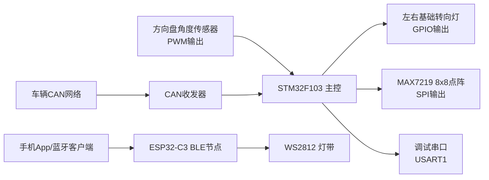
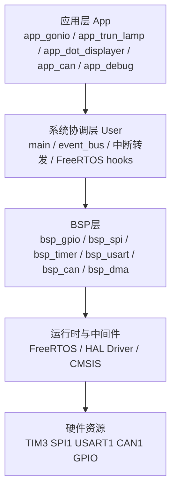

# 车载转向灯与氛围灯项目软件架构设计说明书

> 注：当前源码已完成一次架构重构，核心协作方式从“业务事件位”切换为“`app_state` 共享状态 + `event_bus` 通知位（`SIG_*`）”。本文后续章节仍保留部分旧事件命名，阅读源码时请以当前实现为准。

## 1. 文档目的

本文档用于说明本项目当前代码实现所体现的软件架构设计，帮助开发者快速理解系统分层、模块职责、运行流程、任务协作、硬件依赖与后续扩展方向。

本文档基于仓库当前源码整理，覆盖以下两个子系统：

- `STM32F103` 主控固件子系统
- `ESP32-C3` 蓝牙灯效扩展子系统

其中，`STM32` 子系统是当前主工程核心；`ESP32-C3` 子系统作为并列扩展工程存在，主要承担 BLE 控制与 WS2812 灯带演示能力。

## 2. 项目概述

项目目标是实现一个面向车载场景的灯光控制系统，核心能力包括：

- 通过方向盘角度传感器识别左转、右转、回正状态
- 驱动左右基础转向灯闪烁
- 通过 MAX7219 点阵屏显示左转、右转、加速、减速、停车等图案
- 通过 CAN 总线接收车辆状态并转化为显示事件
- 通过串口输出调试日志，便于硬件联调
- 预留蓝牙侧扩展能力，由 `ESP32-C3` 实现 BLE 指令控制和 WS2812 灯效输出

从软件形态看，本项目是一个典型的嵌入式分层架构：

- 底层以 `STM32 HAL + CMSIS` 为硬件访问基础
- 中间层用 `BSP` 统一封装 GPIO/SPI/TIM/USART/CAN
- 上层以 `FreeRTOS` 任务和事件总线承载业务逻辑
- 业务模块围绕“转向判断、灯光驱动、显示驱动、CAN 协议解析”展开

## 3. 总体架构

### 3.1 系统上下文

说明：

- `STM32F103` 负责主控制链路，是当前仓库中的主业务实现主体。
- `ESP32-C3` 是一个独立子工程，当前代码中尚未与 STM32 固件直接联动，而是作为蓝牙侧扩展控制端存在。
- CAN 接入真实车载总线时，需要外接物理收发器；代码中也提供了回环/自测模式，便于无总线环境联调。

### 3.2 软件分层

分层原则如下：

- `App` 层只关心业务语义，不直接操作底层寄存器。
- `User` 层负责系统启动、任务编排、全局事件总线和中断入口对接。
- `BSP` 层负责“某类外设如何初始化和访问”的统一封装。
- `HAL/CMSIS/FreeRTOS` 构成底座，尽量不与业务逻辑耦合。

## 4. 目录与模块组织

### 4.1 目录职责

| 目录 | 职责 |
| --- | --- |
| `mcu/user` | 系统入口、任务创建、事件总线、中断处理、FreeRTOS 钩子 |
| `mcu/app` | 业务应用模块，承载方向识别、灯光控制、点阵显示、CAN 协议解析、调试输出 |
| `mcu/bsp` | 板级支持包，对 GPIO、SPI、TIM、USART、CAN、DMA 做二次封装 |
| `mcu/libx` | 基础类型、错误码、移植配置等公共支撑代码 |
| `mcu/Libraries` | STM32 CMSIS、HAL Driver、启动文件、链接脚本 |
| `crm/freeRTOS` | FreeRTOS 内核与 ARM CM3 移植层 |
| `project` | CMake 工程配置、交叉编译工具链配置 |
| `ESP32-C3` | ESP32-C3 蓝牙与 WS2812 灯效独立工程 |
| `doc` | 原理图、数据手册、接线图、协议截图及本架构文档 |

### 4.2 模块关系

当前主链路中，模块依赖关系可以概括为：

- `main.c` 统一初始化各模块并创建任务
- `event_bus` 作为应用模块之间的事件交互中心
- `app_gonio` 负责产生转向类事件
- `app_can` 负责产生车辆状态类事件
- `app_trun_lamp` 负责消费转向类事件并控制 GPIO 灯闪烁
- `app_dot_displayer` 负责消费转向/车辆状态事件并控制点阵显示
- `app_debug` 为所有模块提供 `printf` 串口输出能力
- `stm32f1xx_it.c` 将硬件中断转发到应用模块或 RTOS

## 5. STM32 主控软件架构

### 5.1 启动与初始化流程

系统入口在 `mcu/user/main.c`，初始化顺序如下：

1. `HAL_Init()`
2. `event_bus_init()`
3. `app_debug_init()`
4. `app_trunL_init()`
5. `app_gonio_init()`
6. `app_dotD_Init()`
7. `app_can_init()`
8. 创建四个 FreeRTOS 任务
9. `vTaskStartScheduler()`

该顺序体现了以下设计意图：

- 先准备 HAL 和 RTOS 依赖的基础运行环境
- 先创建全局事件总线，再初始化会依赖事件机制的应用模块
- 优先初始化串口调试能力，保证后续模块初始化异常时可输出日志
- 所有业务功能在调度器启动后统一由任务驱动，而非在 `main` 中轮询执行

### 5.2 任务模型

当前系统创建了 4 个业务任务，优先级均为 `2`：

| 任务名 | 入口函数 | 栈深度 | 职责 |
| --- | --- | --- | --- |
| `Angle` | `app_gonio_dispose_Task()` | 256 words | 读取方向盘角度、做稳定判定、发出左转/右转/回正事件 |
| `Trun` | `app_trunL_dispose_Task()` | 128 words | 根据事件驱动左右转向灯闪烁 |
| `Task_DotD` | `app_dotD_dispose_Task()` | 256 words | 根据事件切换点阵显示图案 |
| `CAN` | `app_can_dispose_Task()` | 128 words | 从 CAN 接收队列取报文，解析协议并发出加速/减速/停车事件 |

设计特点：

- 任务划分遵循“单一职责”，每个任务只负责一条业务链。
- 任务间不直接相互调用，而是通过事件组松耦合协作。
- 使用相同优先级，简化调度关系，避免人为优先级倒置。
- 对打印较多的任务显式增大栈空间，例如 `Angle` 和 `Task_DotD`。

### 5.3 事件总线设计

系统通过 `FreeRTOS EventGroup` 实现轻量级全局事件总线，定义在 `mcu/user/event_bus.h`。

事件按照语义分区：

- 底层驱动事件：`EVT_USART_RX`、`EVT_CAN_RX`
- 控制逻辑事件：`EVT_TURN_BACK`、`EVT_TURN_LEFT`、`EVT_TURN_RIGHT`、`EVT_UP`、`EVT_DOWN`、`EVT_STOP`
- 用户交互事件：`EVT_USER_COM`

当前实际生效的主链路事件为：

- 转向链路：`EVT_TURN_LEFT`、`EVT_TURN_RIGHT`、`EVT_TURN_BACK`
- 车辆状态链路：`EVT_UP`、`EVT_DOWN`、`EVT_STOP`
- 调试辅助：`EVT_CAN_RX`

其中：

- `EVT_USART_RX` 与 `EVT_USER_COM` 已完成预留，但当前代码中尚无稳定生产者。
- 点阵任务监听了 `EVT_USER_COM`，为未来接入人体接近、蓝牙靠近或其他交互源留下了扩展位。

### 5.4 转向识别子系统

`app_gonio` 是方向盘角度识别模块，采用 `TIM3` 输入捕获解码 PWM 形式的磁编码器输出。

核心设计如下：

- `PA6 / TIM3_CH1` 作为角度传感器输入
- CH1 捕获周期，CH2 捕获高电平宽度
- 由 `TIM3_IRQHandler -> HAL_TIM_IRQHandler -> HAL_TIM_IC_CaptureCallback -> app_gonio_dispose_ISP()` 完成中断链路
- 中断只负责搬运采样值，不直接做业务判定
- 业务任务每 `20ms` 读取一次角度，使用稳定计数避免抖动误判

角度算法设计：

- 先把 PWM 占空比解码为 `0~360°` 绝对角度
- 第一次有效角度自动记为零点
- 后续计算相对角度 `rel = abs_angle - zero`
- 通过 wrap 逻辑把相对角度限制在 `[-180°, +180°]`

转向状态机设计：

- `STEER_CENTER`：中位状态
- `STEER_LEFT`：左转状态
- `STEER_RIGHT`：右转状态

判定规则：

- 相对角度 `>= +90°` 且持续约 `300ms`，产生 `EVT_TURN_LEFT`
- 相对角度 `<= -90°` 且持续约 `300ms`，产生 `EVT_TURN_RIGHT`
- 已处于左右转状态时，只有回到 `±30°` 且持续约 `300ms` 才产生 `EVT_TURN_BACK`

该设计的优点是：

- 自动校零，降低安装与标定门槛
- 有抗抖动能力，避免瞬时误触发
- 用事件方式输出结果，可供多个消费者复用

### 5.5 转向灯执行子系统

`app_trun_lamp` 负责控制基础左右转向灯。

硬件映射：

- 左转灯：`PA2`
- 右转灯：`PA1`

控制方式：

- 初始化时配置为推挽输出并全部关闭
- 任务使用 `xEventGroupWaitBits()` 同时兼顾“等待事件”和“定时闪烁”
- 闪烁周期为 `500ms`

状态机：

- `state = 0`：回正/常态，关闭所有灯
- `state = 1`：左转，左灯闪烁
- `state = 2`：右转，右灯闪烁

这种实现避免了再额外创建软件定时器或独立时基任务，结构简单，适合资源受限的 MCU 工程。

### 5.6 点阵显示子系统

`app_dot_displayer` 负责驱动 `MAX7219` 点阵显示模块。

硬件映射：

- `SPI1`
- `PA5`：CLK
- `PA7`：DIN
- `PA4`：CS

显示能力：

- 左转箭头
- 右转箭头
- 启动图案
- 加速图案
- 减速图案
- 停车图案

实现特点：

- 图案定义在头文件静态数组中，便于直接替换
- 支持 `TurnCount` 旋转参数，用于适配点阵实际安装方向
- 上电执行“显示测试模式”和 `START` 图案自检，方便硬件联调
- 使用事件驱动模式切换，而不是持续刷新动画

事件优先级策略：

1. `EVT_TURN_BACK`
2. `EVT_TURN_LEFT`
3. `EVT_TURN_RIGHT`
4. `EVT_STOP`
5. `EVT_DOWN`
6. `EVT_UP`
7. `EVT_USER_COM`

这意味着在同时收到多个事件时，点阵显示更偏向“转向/停车安全优先”，再考虑速度变化和交互提示。

### 5.7 CAN 通信与协议解析子系统

CAN 功能被拆成两层：

- `bsp_can`：硬件接收、发送、过滤器、中断与消息缓存
- `app_can`：协议解析、模式映射、事件维护

#### 5.7.1 BSP 层设计

`bsp_can` 采用“中断接收 + 队列缓存”的模式：

- 中断回调 `HAL_CAN_RxFifo0MsgPendingCallback()` 从 FIFO0 取数据
- 组装为 `can_message_t`
- 通过 `xQueueOverwriteFromISR()` 覆盖写入长度为 `1` 的接收队列

该设计表示：

- 只保留“最新一帧”报文
- 适合本项目这类“模式状态”型控制数据
- 避免在中断中做协议解析，降低 ISR 复杂度

CAN 可配置项：

- 引脚重映射
- 正常模式、回环模式、静默回环模式
- 目标波特率自动搜索
- 全接收过滤器

当前默认配置为：

- `BSP_CAN1_REMAP_CASE = 2`
- `BSP_CAN_MODE = CAN_MODE_NORMAL`
- `BSP_CAN_BAUDRATE = 500000`

默认含义是：代码按 `PB8/PB9` 的 CAN 引脚映射工作，并面向真实总线环境设计。

#### 5.7.2 App 层设计

`app_can` 将协议中的“点阵灯模式字段”映射为业务事件。

协议依据：

- `doc/datasheet/can总线通信帧格式.png`
- 当前关注 `Byte2`

模式映射：

| 协议值 | 语义 | 事件 |
| --- | --- | --- |
| `0x00` | 加速 | `EVT_UP` |
| `0x01` | 减速 | `EVT_DOWN` |
| `0x02` | 停车 | `EVT_STOP` |
| `0x03` | 正常 | 清空模式事件 |

任务行为：

- 阻塞读取 CAN 队列，超时周期性输出错误码
- 支持短 DLC 报文兼容读取，便于联调
- 统一在任务上下文清理并设置 `EVT_UP/EVT_DOWN/EVT_STOP`
- 每次收到有效报文时置位 `EVT_CAN_RX`

该设计解决了一个关键问题：

- 某些任务使用 `xEventGroupWaitBits(..., clearOnExit = pdTRUE)` 消费事件
- 如果 CAN 事件只在“模式变化时”设置，事件被消费后可能丢失显示状态
- 因此 `app_can` 采用“对比当前事件状态并恢复”的策略，确保模式显示可持续维持

### 5.8 调试与诊断子系统

`app_debug` 提供统一串口调试能力。

硬件映射：

- `USART1`
- `PA9/PA10`
- 波特率 `115200`

实现方式：

- 通过重写 `__io_putchar()` 将 `printf` 重定向到串口
- 各业务模块均可直接输出日志
- 配套提供初始化错误码和运行错误码打印函数

系统还补充了以下诊断能力：

- `freertos_hooks.c` 中的栈溢出钩子
- `freertos_hooks.c` 中的堆内存不足钩子
- `HardFault_Handler()` 死循环陷入点
- CAN 无报文或 ACK 错误的周期性提示
- 点阵模块上电自检和运行期调试打印

### 5.9 中断与 RTOS 结合方式

当前中断处理遵循“ISR 轻量化，复杂逻辑下沉到任务”的原则。

关键中断链路如下：

- `SysTick_Handler()`
  - 始终调用 `HAL_IncTick()`
  - 仅在调度器启动后调用 `xPortSysTickHandler()`
  - 避免系统在调度器尚未启动时误进入 FreeRTOS tick 处理

- `TIM3_IRQHandler()`
  - 交给 `HAL_TIM_IRQHandler()`
  - 再由 `HAL_TIM_IC_CaptureCallback()` 转发到 `app_gonio`

- `USB_LP_CAN1_RX0_IRQHandler()`
  - 交给 `HAL_CAN_IRQHandler()`
  - 在 HAL 回调中完成消息入队

中断优先级设计：

- TIM3 输入捕获中断优先级较高，用于及时采样角度
- CAN 与 USART 相关优先级设置为 `6`
- 与 FreeRTOS `configLIBRARY_MAX_SYSCALL_INTERRUPT_PRIORITY = 5` 相匹配，允许安全调用 `FromISR` API

## 6. ESP32-C3 蓝牙扩展子系统

### 6.1 子系统定位

`ESP32-C3/ESP32-C3_Bluetooth/ESP32-C3_Bluetooth.ino` 是一个独立 Arduino 风格工程，目标是通过 BLE 接收手机命令，并控制 `WS2812` 灯带做灯效反馈。

从当前仓库实现看，它与 STM32 主固件是并列关系，不是 STM32 架构内部的一个运行模块。

### 6.2 功能结构

主要能力包括：

- 创建 BLE 服务与特征
- 接收手机写入的字符串命令
- 控制左右灯带闪烁、全灯红色刹车、危险报警闪烁、全灯关闭
- 通过 Notify 回发执行结果
- 周期性推送心跳包

命令集合：

- `turnright`
- `turnleft`
- `danger`
- `offled`
- `brake`

运行模式：

- 在 `setup()` 中完成 BLE 广播与 LED 初始化
- 在 `loop()` 中执行左右/危险闪烁逻辑和 BLE 心跳推送
- 使用 `millis()` 做非阻塞闪烁控制

### 6.3 与主系统的关系

当前代码层面，两套系统尚未建立直接通信链路，因此可视为：

- `STM32`：车载控制主链路
- `ESP32-C3`：移动端交互与氛围灯扩展链路

后续如果需要整合，可考虑以下方式：

- UART：由 STM32 向 ESP32 下发灯效命令
- CAN：把 ESP32 作为车载扩展节点
- GPIO：最简方式，仅传递几个状态位

## 7. 构建、烧录与调试架构

### 7.1 构建方式

工程采用 `CMake + arm-none-eabi-gcc + Ninja` 构建，主工程配置位于：

- `project/CMakeLists.txt`
- `project/arm-gnu-none-eabi.cmake`

构建对象包括：

- 用户代码 `mcu/user`
- 应用代码 `mcu/app`
- BSP 代码 `mcu/bsp`
- 基础公共库 `mcu/libx`
- FreeRTOS 内核
- STM32 HAL/CMSIS

产物包括：

- `ATMOSPHERE_LAMP.elf`
- `ATMOSPHERE_LAMP.hex`
- `ATMOSPHERE_LAMP.bin`

### 7.2 VS Code 集成

`.vscode/tasks.json` 已定义：

- `CMake 配置`
- `CMake 构建`
- `烧录`
- `清理`

`.vscode/launch.json` 提供基于 `OpenOCD + cortex-debug` 的调试配置。

因此当前工程不仅适合命令行构建，也适合在 IDE 中完成编译、下载和单步调试。

## 8. 关键设计特点

### 8.1 优点

- 分层明确，业务逻辑与外设细节基本分离
- 任务职责清晰，利于持续扩展
- 事件总线降低模块间耦合度
- 中断处理短小，实时性较好
- CAN 设计兼顾真实总线与无收发器联调场景
- 点阵显示与转向灯控制均采用状态机思想，行为稳定可预测
- 调试信息较丰富，适合硬件联调阶段快速定位问题

### 8.2 当前架构中的预留与演进迹象

从源码可以看出，项目已为后续扩展保留了若干入口：

- 预留事件位：`EVT_USART_RX`、`EVT_USER_COM`
- 预留 DMA 封装，但当前主流程未使用
- 保留旧版 `CAN_RxDataHandle.*` 代码，说明 CAN 架构经历过迭代
- 点阵图案支持旋转，便于不同安装方向复用
- CAN 支持回环和自测发送，利于脱离整车环境单板验证

## 9. 架构约束与后续优化建议

以下内容不是对当前设计的否定，而是基于现有源码整理出的后续优化方向。

### 9.1 可继续完善的点

1. 建议补充统一的系统时钟配置模块。

从当前源码看，`main` 中未显式提供 `SystemClock_Config()`。现有部分外设注释按 `72MHz` 推导参数，后续应明确系统主频配置并与 TIM/CAN/串口参数统一校准。

2. 建议把事件语义继续细分为“瞬时事件”和“状态事件”。

目前事件组同时承载两类语义，虽然已经可用，但后续事件数量继续增长时，建议将持续状态与一次性触发拆分，避免消费策略互相影响。

3. 建议为显示层增加统一的显示仲裁器。

当前点阵优先级写在任务内部，后续若加入更多来源，例如 BLE、用户接近、故障报警，可考虑抽象成显示策略模块。

4. 建议清理或归档历史代码。

例如 `CAN_RxDataHandle.*` 与当前主链路不再一致，后续可将其移动到 `legacy/` 或单独说明，减少阅读歧义。

5. 建议逐步补充模块级测试和联调说明。

尤其是角度阈值、点阵图案、CAN 模式映射、引脚重映射等配置项，适合整理成更明确的调试手册。

### 9.2 推荐的后续演进路线

- 第一阶段：补全时钟配置、接线说明和模块配置说明
- 第二阶段：整合 ESP32 与 STM32 的通信协议
- 第三阶段：抽象统一的灯效/显示策略中心
- 第四阶段：增加故障检测、降级策略和配置持久化能力

## 10. 结论

当前项目已经形成了一个结构清晰的嵌入式控制架构：以 `STM32F103 + FreeRTOS` 为核心，通过事件驱动将“角度识别、CAN 状态解析、基础转向灯控制、点阵显示”解耦组织，并辅以串口调试与钩子诊断机制，具备较好的联调可维护性。

同时，仓库中的 `ESP32-C3` 子工程为移动端交互和氛围灯扩展提供了清晰方向。整体来看，本项目已经具备从单板联调走向多节点协同控制的良好基础，后续只需沿着“统一状态模型、明确通信边界、增强配置管理”三个方向持续演进，即可逐步形成更完整的车载灯光控制软件平台。
