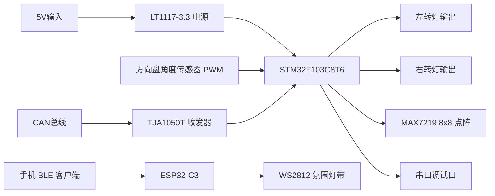
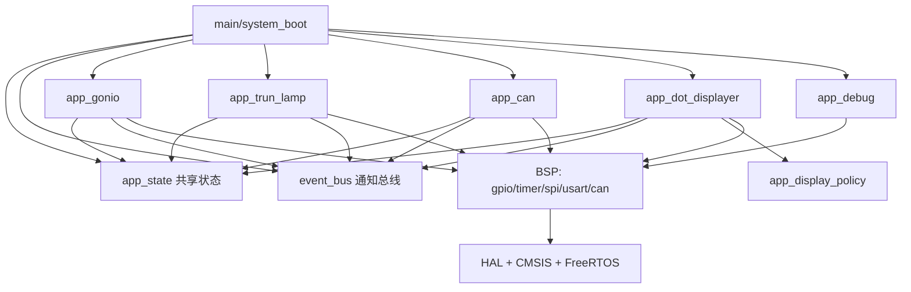
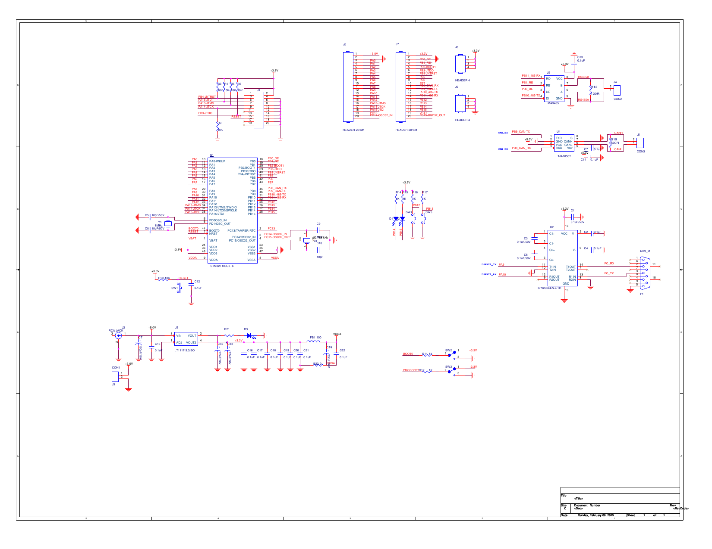
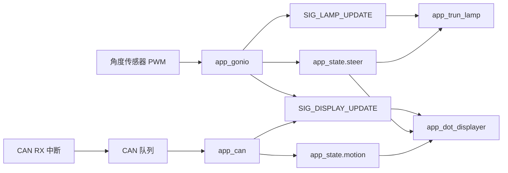

# 智能氛围灯项目框架设计

## 1. 项目定位

本项目面向车载灯光控制场景，当前仓库实际包含两个相互独立但可扩展联动的子系统：

1. `STM32F103` 主控固件
2. `ESP32-C3` 蓝牙灯效扩展固件

从源码现状看，`STM32` 子系统已经形成完整主链路，负责“方向采集 -> 转向灯控制 -> 点阵显示 -> CAN 解析 -> 串口调试”；`ESP32-C3` 子系统目前是独立演示工程，负责“BLE 指令 -> WS2812 灯效”。

因此，本项目可以定义为：

> 一套以 `STM32F103C8T6` 为主控制器、以车载转向/状态显示为核心、预留蓝牙氛围灯扩展能力的智能灯光控制系统。

## 2. 项目需求分析

### 2.1 功能需求

| 编号 | 需求项 | 当前实现情况 |
| --- | --- | --- |
| FR-1 | 采集方向盘角度，识别左转、右转、回正 | 已实现，`TIM3` 输入捕获 + 稳态判定 |
| FR-2 | 根据转向状态驱动左右基础转向灯闪烁 | 已实现，`PA2/PA1` GPIO 输出 |
| FR-3 | 根据转向/车辆状态驱动 8x8 点阵显示图案 | 已实现，`MAX7219 + SPI1` |
| FR-4 | 通过 CAN 总线接收车辆状态并驱动显示 | 已实现，默认解析 Byte2 |
| FR-5 | 通过串口输出调试日志，便于联调 | 已实现，`USART1 115200` |
| FR-6 | 支持蓝牙命令控制氛围灯带 | 已实现于独立 `ESP32-C3` 子工程 |
| FR-7 | 保留用户交互或近场提示扩展位 | 已预留，`user_hint` 与 `SIG_RESERVED_USER` |
| FR-8 | 系统具备清晰分层，便于继续扩展 | 已实现，`App/User/BSP` 分层清晰 |

### 2.2 非功能需求

| 编号 | 需求项 | 设计落点 |
| --- | --- | --- |
| NFR-1 | 具备实时响应能力 | `FreeRTOS` 任务 + 中断快速搬运 |
| NFR-2 | 模块低耦合 | `app_state` 与 `event_bus` 解耦状态和通知 |
| NFR-3 | 便于硬件联调 | 串口日志、CAN 错误打印、点阵上电自检 |
| NFR-4 | 便于移植和维护 | `BSP` 封装 GPIO/SPI/TIM/CAN/USART |
| NFR-5 | 适配资源受限 MCU | 任务数量有限、队列长度受控、逻辑简单直接 |

## 3. 对应实物与代码映射

### 3.1 系统实物组成

| 实物/器件 | 代码对应 | 接口/芯片 | 作用 |
| --- | --- | --- | --- |
| STM32F103C8T6 工控板 | `mcu/user` + `mcu/app` + `mcu/bsp` | `U1` | 主控制器，负责主业务链路 |
| 外部方向盘角度传感器 | `app_gonio` | `PA6 / TIM3_CH1` | 输出 PWM 角度信号 |
| 左右转向灯或灯驱输入级 | `app_trun_lamp` | `PA2 / PA1` | 输出左右转向闪烁控制 |
| MAX7219 8x8 点阵模块 | `app_dot_displayer` + `bsp_max7219` | `PA5/PA7/PA4` | 显示转向/加速/减速/停车图案 |
| CAN 收发器 `TJA1050T` | `bsp_can` + `app_can` | `PB8/PB9 -> U4 -> J5` | 接入车辆 CAN 网络 |
| 调试串口链路 | `app_debug` + `bsp_usart` | `PA9/PA10 -> SP3232` | 输出日志和错误信息 |
| 5V 输入与 3.3V 稳压 | 板级硬件 | `U5 LT1117-3.3` | 给 MCU 与外设供电 |
| ESP32-C3 开发板 | `ESP32-C3_Bluetooth.ino` | BLE + GPIO5 | 接收手机命令并驱动灯带 |
| WS2812 灯带 | `ESP32-C3_Bluetooth.ino` | `GPIO5` | 氛围灯、刹车灯、双闪效果 |
| 手机 BLE 客户端 | ESP32 扩展工程 | BLE | 下发灯效控制命令 |

### 3.2 已确认和推断的边界

- 已确认：板载原理图明确包含 `STM32F103C8T6`、`TJA1050T` CAN 收发器、`LT1117-3.3` 稳压、`SP3232EEN-L/TR` 串口转换电路。
- 已确认：源码明确把 `PA6` 用作角度 PWM 输入，把 `PA1/PA2` 用作左右灯输出，把 `SPI1` 用作点阵接口。
- 推断：`PA1/PA2` 更适合作为“驱动级输入”或“低功率 LED 指示”控制信号。如果要直接控制真实车载 12V 灯具，需要补充 MOSFET/继电器/高边驱动器，当前仓库中未看到这一级功率驱动电路。
- 已确认：`ESP32-C3` 工程与 STM32 主控工程当前没有直接通信代码，二者是并列子系统而非已集成单系统。

## 4. 总体方案框图

### 4.1 物理系统框图



### 4.2 软件框图



## 5. 硬件设计分析

### 5.1 原理图截图




### 5.2 电源部分分析

根据 `doc/schematic/stm32工控板 _ MCU原理图.pdf` 可确认：

- 板卡提供 `+5V` 输入。
- `U5` 使用 `LT1117-3.3` 将 `5V` 转换为 `3.3V`。
- 周围配置了输入/输出滤波和去耦电容，`VDDA` 侧还有磁珠 `FB1` 与额外去耦，说明模拟电源和数字电源做了基础隔离。

这与固件中的时钟与 GPIO 驱动方式一致，说明主控逻辑运行在标准 `3.3V` 逻辑域。

### 5.3 主控 MCU 分析

- 板载主控为 `STM32F103C8T6`。
- 固件在 `system_boot.c` 中配置 `HSE + PLL x9`，目标系统频率为 `72MHz`。
- 关键业务引脚都从 `J6/J7` 连接器引出，便于外接传感器、点阵、CAN、灯具驱动级。

### 5.4 CAN 电路分析

原理图可确认：

- `PB9_CAN-TX` 接到 `U4` 的 `TXD`
- `PB8_CAN_RX` 接到 `U4` 的 `RXD`
- `U4` 为 `TJA1050T`
- 物理总线通过 `CANH/CANL` 接到外部连接器 `J5`
- 板上存在 `120R` 终端电阻位

这与 `bsp_can.h` 默认配置完全一致：

- 使用 `CAN1`
- 默认重映射 CASE 2，即 `PB8/PB9`
- 默认波特率 `500kbps`
- 默认工作模式 `CAN_MODE_NORMAL`

因此，当前 CAN 软硬件对应关系是闭合的。

### 5.5 串口调试电路分析

原理图可确认：

- `USART1_TX / PA9`
- `USART1_RX / PA10`
- 经过 `SP3232EEN-L/TR` 做电平转换后接到 PC 串口接口

对应软件实现：

- `app_debug.c` 中把 `printf` 重定向到 `USART1`
- 波特率固定为 `115200`

因此，当前串口日志不仅适合 TTL 调试，也适合通过板载串口转换链路做 PC 侧观察。

### 5.6 传感器与执行器分析

- 方向盘角度传感器不在工控板原理图内，应为外接模块，经 `PA6` 输入 PWM。
- MAX7219 点阵模块不在主板原理图内，应外接到 `SPI1` 与片选引脚。
- 左右转向灯执行级未在现有源码中体现驱动芯片，说明当前代码更像“灯光控制信号输出层”，真实车规负载仍需补功率驱动设计。

## 6. 软件架构设计

### 6.1 启动顺序

系统启动顺序如下：

1. `HAL_Init()`
2. `SystemClock_Config()`
3. `event_bus_init()`
4. `app_state_init()`
5. `app_debug_init()`
6. `app_trunL_init()`
7. `app_gonio_init()`
8. `app_dotD_Init()`
9. `app_can_init()`
10. 创建 4 个业务任务
11. `vTaskStartScheduler()`

### 6.2 任务划分

| 任务名 | 入口函数 | 栈深度 | 职责 |
| --- | --- | --- | --- |
| `Angle` | `app_gonio_dispose_Task()` | 256 | 方向采样与转向判定 |
| `Trun` | `app_trunL_dispose_Task()` | 128 | 左右灯闪烁控制 |
| `Task_DotD` | `app_dotD_dispose_Task()` | 256 | 点阵显示刷新 |
| `CAN` | `app_can_dispose_Task()` | 128 | CAN 报文解析与显示状态更新 |

所有业务任务优先级均为 `2`，整体策略是：

- 中断只做快速搬运
- 业务逻辑在任务上下文中完成
- 共享状态存于 `app_state`
- 唤醒通知由 `event_bus` 发送

### 6.3 状态与通知机制

`app_state` 是唯一真相源，保存：

- `steer`：方向状态
- `motion`：车辆运动模式
- `user_hint`：预留用户提示状态

`event_bus` 只保存通知位：

- `SIG_LAMP_UPDATE`
- `SIG_DISPLAY_UPDATE`
- `SIG_CAN_RX`
- `SIG_RESERVED_USER`

这种设计把“状态值”与“同步事件”解耦，避免事件消费后状态丢失。

### 6.4 主数据流



## 7. 高层软件伪代码

### 7.1 系统启动伪代码

```c
main()
{
    if (system_boot_run() == OK)
    {
        vTaskStartScheduler();
    }
    while (1) {}
}

system_boot_run()
{
    HAL_Init();
    SystemClock_Config();
    event_bus_init();
    app_state_init();
    app_debug_init();
    app_trunL_init();
    app_gonio_init();
    app_dotD_Init();
    app_can_init();
    create_task(Angle);
    create_task(Trun);
    create_task(Task_DotD);
    create_task(CAN);
    return OK;
}
```

### 7.2 系统运行伪代码

```c
AngleTask:
    周期读取相对角度
    满足左/右/回正稳定条件后更新 app_state.steer
    置位 SIG_LAMP_UPDATE 和 SIG_DISPLAY_UPDATE

CanTask:
    阻塞读取最新 CAN 帧
    解析 Byte2 模式
    更新 app_state.motion
    置位 SIG_DISPLAY_UPDATE

LampTask:
    等待 SIG_LAMP_UPDATE 或 500ms 超时
    读取 app_state.steer
    控制左/右灯闪烁

DotTask:
    等待 SIG_DISPLAY_UPDATE
    读取 app_state 快照
    由显示策略选择图案
    刷新 MAX7219
```

## 8. 当前实现结论

### 8.1 已完成的主链路

- 方向采样、转向灯控制、点阵显示、CAN 解析、串口调试已经形成闭环实现。
- 主控板级资源与软件映射关系清晰，适合继续扩展。

### 8.2 当前边界与扩展点

- `ESP32-C3` 氛围灯带子系统已实现演示功能，但未与 STM32 主控打通。
- `user_hint` 仍处于预留状态，可扩展人体接近、手机靠近、蓝牙联动等触发源。
- 若面向真实车载灯具，需要补充功率驱动、浪涌保护、反接保护和 EMC 设计。

