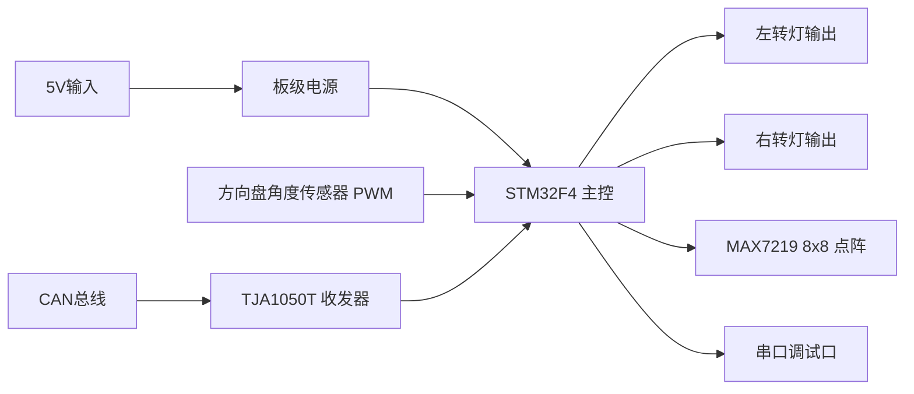
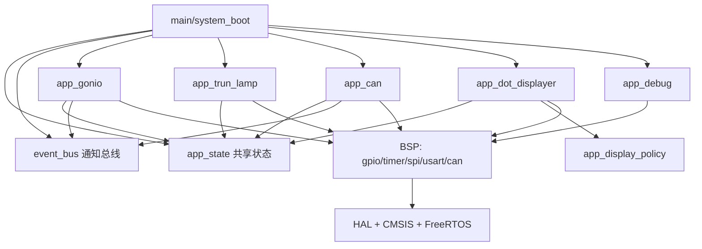
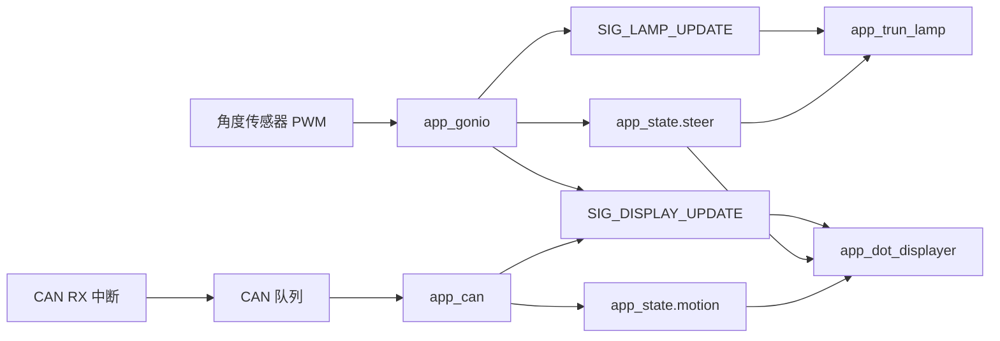

# 智能氛围灯项目框架设计

## 1. 项目定位

本项目面向车载灯光控制场景，当前方案收敛为单主控架构：

- 以 `STM32F4` 作为唯一主控制器
- 由主控统一完成方向采集、转向灯控制、点阵显示、CAN 解析与调试输出
- 当前阶段不考虑外部无线连接与独立扩展控制器

因此，本项目可以定义为：

> 一套以 `STM32F4` 为主控制平台、以车载转向/状态显示为核心，并为后续网络通信保留扩展空间的智能灯光控制系统。

## 2. 项目需求分析

### 2.1 功能需求

| 编号 | 需求项 | 当前实现情况 |
| --- | --- | --- |
| FR-1 | 采集方向盘角度，识别左转、右转、回正 | 已实现，`TIM3` 输入捕获 + 稳态判定 |
| FR-2 | 根据转向状态驱动左右基础转向灯闪烁 | 已实现，`PA2/PA1` GPIO 输出 |
| FR-3 | 根据转向/车辆状态驱动 8x8 点阵显示图案 | 已实现，`MAX7219 + SPI1` |
| FR-4 | 通过 CAN 总线接收车辆状态并驱动显示 | 已实现，默认解析 `Byte2` |
| FR-5 | 通过串口输出调试日志，便于联调 | 已实现，`USART1 115200` |
| FR-6 | 保留用户交互或外部指令扩展位 | 已预留，`user_hint` 与 `SIG_RESERVED_USER` |
| FR-7 | 系统具备清晰分层，便于继续扩展 | 已实现，`App/User/BSP` 分层清晰 |

### 2.2 非功能需求

| 编号 | 需求项 | 设计落点 |
| --- | --- | --- |
| NFR-1 | 具备实时响应能力 | `FreeRTOS` 任务 + 中断快速搬运 |
| NFR-2 | 模块低耦合 | `app_state` 与 `event_bus` 解耦状态和通知 |
| NFR-3 | 便于硬件联调 | 串口日志、CAN 错误打印、点阵上电自检 |
| NFR-4 | 便于移植和维护 | `BSP` 封装 GPIO/SPI/TIM/CAN/USART |
| NFR-5 | 为后续网络通信留足资源空间 | `STM32F4` 平台具备更高性能与接口扩展余量 |

## 3. 对应实物与代码映射

### 3.1 系统实物组成

| 实物/器件 | 代码对应 | 接口/芯片 | 作用 |
| --- | --- | --- | --- |
| `STM32F4` 主控板 | `mcu/user` + `mcu/app` + `mcu/bsp` | 主控 MCU | 统一承担主业务链路 |
| 外部方向盘角度传感器 | `app_gonio` | `PA6 / TIM3_CH1` | 输出 PWM 角度信号 |
| 左右转向灯或灯驱输入级 | `app_trun_lamp` | `PA2 / PA1` | 输出左右转向闪烁控制 |
| MAX7219 8x8 点阵模块 | `app_dot_displayer` + `bsp_max7219` | `PA5/PA7/PA4` | 显示转向/加速/减速/停车图案 |
| CAN 收发器 `TJA1050T` | `bsp_can` + `app_can` | `PB8/PB9 -> U4 -> J5` | 接入车辆 CAN 网络 |
| 调试串口链路 | `app_debug` + `bsp_usart` | `PA9/PA10 -> SP3232` | 输出日志和错误信息 |
| 5V 输入与 3.3V 稳压 | 板级硬件 | 电源链路 | 给 MCU 与外设供电 |

### 3.2 当前边界与设计假设

- 当前文档按单主控 `STM32F4` 方案组织，所有执行器与显示设备均由主控统一驱动。
- 现有仓库中仍保留部分历史板卡资料和旧型号附件，但不再作为当前方案的功能边界描述。
- `PA1/PA2` 更适合作为“驱动级输入”或“低功率 LED 指示”控制信号；若直接控制真实车载 12V 灯具，仍需补充功率驱动与保护电路。
- `STM32F4` 平台升级后的额外算力与接口资源，主要用于后续网络通信、远程诊断和参数配置扩展。

## 4. 总体方案框图

### 4.1 物理系统框图



### 4.2 软件框图



## 5. 硬件设计分析

### 5.1 原理图附件


当前仓库中的板卡截图和 PDF 主要用于说明既有外设连接关系。迁移到 `STM32F4` 主控板后，应补充新的原理图、引脚复用表和启动配置说明。

### 5.2 电源部分分析

根据现有附件可确认：

- 板卡提供 `+5V` 输入
- 主控和外设运行在标准 `3.3V` 逻辑域
- 模拟电源与数字电源存在基础去耦与隔离设计

这些结论对迁移到 `STM32F4` 方案仍然成立，但具体稳压器件、时钟源与电源完整性设计应以新板资料为准。

### 5.3 主控平台分析

- 当前主控方案已升级为 `STM32F4` 系列
- 相比早期方案，`STM32F4` 在主频、存储、外设资源与扩展能力上更适合承载后续复杂功能
- 现阶段软件主链路仍围绕转向识别、灯光驱动、点阵显示、CAN 解析与调试输出展开
- 后续若引入网络通信，可在 `STM32F4` 平台上进一步扩展协议栈、状态上报与远程配置能力

### 5.4 CAN 电路分析

现有软件默认按以下关系工作：

- `PB9_CAN-TX` 对接收发器 `TXD`
- `PB8_CAN_RX` 对接收发器 `RXD`
- 物理总线通过 `CANH/CANL` 接到外部连接器
- 板上预留终端电阻位

这与 `bsp_can.h` 的默认配置保持一致：

- 使用 `CAN1`
- 默认重映射 CASE 2，即 `PB8/PB9`
- 默认波特率 `500kbps`
- 默认工作模式 `CAN_MODE_NORMAL`

迁移到 `STM32F4` 板卡时，以上引脚与位时序参数仍需结合新板原理图和时钟树重新核对。

### 5.5 串口调试电路分析

当前串口调试链路采用：

- `USART1_TX / PA9`
- `USART1_RX / PA10`
- 外接串口转换电路到 PC 调试端

软件实现为：

- `app_debug.c` 将 `printf` 重定向到 `USART1`
- 波特率固定为 `115200`

### 5.6 传感器与执行器分析

- 方向盘角度传感器通过 PWM 输出接入主控输入捕获通道
- MAX7219 点阵模块由主控经 `SPI1` 直接驱动
- 左右转向灯由主控 GPIO 直接输出控制信号
- 当前方案不再引入独立外部控制节点，所有控制链路均收敛到主控芯片

## 6. 软件架构设计

### 6.1 启动顺序

系统启动顺序如下：

1. `HAL_Init()`
2. `SystemClock_Config()`
3. `event_bus_init()`
4. `app_state_init()`
5. `app_debug_init()`
6. `app_trunL_init()`
7. `app_gonio_init()`
8. `app_dotD_Init()`
9. `app_can_init()`
10. 创建 4 个业务任务
11. `vTaskStartScheduler()`

### 6.2 任务划分

| 任务名 | 入口函数 | 栈深度 | 职责 |
| --- | --- | --- | --- |
| `Angle` | `app_gonio_dispose_Task()` | 256 | 方向采样与转向判定 |
| `Trun` | `app_trunL_dispose_Task()` | 128 | 左右灯闪烁控制 |
| `Task_DotD` | `app_dotD_dispose_Task()` | 256 | 点阵显示刷新 |
| `CAN` | `app_can_dispose_Task()` | 128 | CAN 报文解析与显示状态更新 |

整体策略是：

- 中断只做快速搬运
- 业务逻辑在任务上下文中完成
- 共享状态存于 `app_state`
- 唤醒通知由 `event_bus` 发送

### 6.3 状态与通知机制

`app_state` 是唯一真相源，保存：

- `steer`：方向状态
- `motion`：车辆运动模式
- `user_hint`：预留用户提示状态

`event_bus` 只保存通知位：

- `SIG_LAMP_UPDATE`
- `SIG_DISPLAY_UPDATE`
- `SIG_CAN_RX`
- `SIG_RESERVED_USER`

这种设计把“状态值”与“同步事件”解耦，避免事件消费后状态丢失。

### 6.4 主数据流



## 7. 高层软件伪代码

### 7.1 系统启动伪代码

```c
main()
{
    if (system_boot_run() == OK)
    {
        vTaskStartScheduler();
    }
    while (1) {}
}

system_boot_run()
{
    HAL_Init();
    SystemClock_Config();
    event_bus_init();
    app_state_init();
    app_debug_init();
    app_trunL_init();
    app_gonio_init();
    app_dotD_Init();
    app_can_init();
    create_task(Angle);
    create_task(Trun);
    create_task(Task_DotD);
    create_task(CAN);
    return OK;
}
```

### 7.2 系统运行伪代码

```c
AngleTask:
    周期读取相对角度
    满足左/右/回正稳定条件后更新 app_state.steer
    置位 SIG_LAMP_UPDATE 和 SIG_DISPLAY_UPDATE

CanTask:
    阻塞读取最新 CAN 帧
    解析 Byte2 模式
    更新 app_state.motion
    置位 SIG_DISPLAY_UPDATE

LampTask:
    等待 SIG_LAMP_UPDATE 或 500ms 超时
    读取 app_state.steer
    控制左/右灯闪烁

DotTask:
    等待 SIG_DISPLAY_UPDATE
    读取 app_state 快照
    由显示策略选择图案
    刷新 MAX7219
```

## 8. 当前实现结论

### 8.1 已完成的主链路

- 方向采样、转向灯控制、点阵显示、CAN 解析、串口调试已经形成闭环实现
- 主控板级资源与软件映射关系清晰，适合继续扩展
- 当前所有执行器与显示模块均由主控统一调度

### 8.2 当前边界与扩展点

- 当前阶段不考虑外部无线连接、远端直接控制和独立扩展控制器
- `user_hint` 仍处于预留状态，可扩展本地交互、故障提示或网络下发指令
- 若面向真实车载灯具，需要补充功率驱动、浪涌保护、反接保护和 EMC 设计
- 随着主控平台升级到 `STM32F4`，后续可规划网络通信能力，用于远程诊断、状态上报和参数配置
